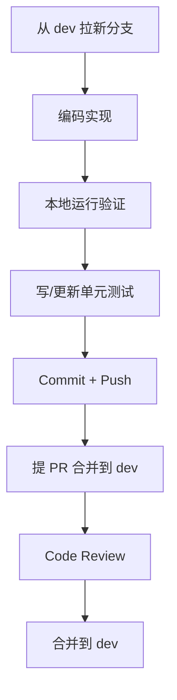

# 项目开发工作区规范

> 适用于 DrawGuess v2.0 — Java Spring Boot 重写项目

---

## 文件夹结构

```
DrawGuess-v2.0/
├── draw-guess-server/         ← Java Maven 项目（全部代码在此）
│   ├── src/
│   ├── docker/
│   └── pom.xml
├── docs/                      ← 产品文档区
│   └── PRD.md                 ← 需求文档
├── README.md                  ← 项目总说明
└── AGENTS.md                  ← 本文件（开发工作区规范）
```

| 文件夹 | 用途 | 存放内容 |
|--------|------|---------|
| `docs/` | 产品文档区 | PRD、技术方案、设计决策 |
| `draw-guess-server/src/` | 代码区 | 全部 Java 项目代码 |
| 项目根目录 | 配置与说明 | README、Docker Compose、AGENTS |

---

## 开发规则

### 1. 代码规范

#### 1.1 分层架构

所有代码遵循严格的分层结构，禁止跨层调用：

```
Controller (API 入口)
    ↓
Service (业务逻辑)
    ↓
Mapper (数据库操作)
```

- **Controller 层**：只做参数校验和路由转发，不写业务逻辑
- **Service 层**：写业务逻辑，调用 Mapper 或其它 Service
- **Mapper 层**：只做数据库 CRUD，不写业务逻辑
- **禁止** Controller 直接调用 Mapper，也禁止 Service 互相循环调用

#### 1.2 命名规范

| 类型 | 命名示例 | 说明 |
|------|---------|------|
| 类名 | `UserController`、`UserService`、`UserMapper` | 大驼峰 |
| 方法名 | `createUser`、`getUserByPhone` | 小驼峰 |
| 变量名 | `userId`、`nickname`、`totalScore` | 小驼峰 |
| 包名 | `com.drawguess.controller`、`.service`、`.mapper` | 全小写 |
| 表名 | `user`、`game_record`、`room_member` | 下划线 |
| 字段名 | `user_id`、`total_score`、`painter_order` | 下划线 |

#### 1.3 统一响应格式

所有 API 响应使用 `ApiResponse<T>` 包装：

```java
// 成功
ApiResponse.success(data)
ApiResponse.success("操作成功")

// 失败
ApiResponse.error(400, "参数错误")
ApiResponse.error(401, "未登录")
ApiResponse.error(403, "权限不足")
ApiResponse.error(500, "服务器内部错误")
```

#### 1.4 异常处理

- 业务异常使用自定义 `BusinessException`，带错误码
- 全局异常通过 `GlobalExceptionHandler` 统一处理
- 禁止 Controller 层 try-catch 后吞掉异常

```java
// Controller 层 - 不捕获异常
@GetMapping("/user")
public ApiResponse<UserVO> getUser(@RequestParam Long id) {
    return ApiResponse.success(userService.getUserById(id));
}

// Service 层 - 抛业务异常
public UserVO getUserById(Long id) {
    User user = userMapper.selectById(id);
    if (user == null) {
        throw new BusinessException(ResultCode.USER_NOT_FOUND);
    }
    return UserVO.fromEntity(user);
}
```

#### 1.5 日志规范

- 使用 SLF4J + Logback，禁止使用 `System.out.println()`
- 每个类声明 `private static final Logger log = LoggerFactory.getLogger(Xxx.class);`
- 关键操作（创建、删除、审核）记录业务日志

```java
// 入口/出口日志
log.info("用户 {} 尝试登录", phone);

// 异常日志
log.error("创建房间失败, userId={}", userId, e);
```

#### 1.6 注释规范

- 类注释：说明类的职责
- 方法注释：说明功能、参数、返回值
- 复杂逻辑加行内注释
- 接口方法必须有文档注释

```java
/**
 * 用户注册
 *
 * @param request 注册请求（昵称、手机号、密码）
 * @return 注册结果
 */
@PostMapping("/register")
public ApiResponse<Void> register(@Valid @RequestBody RegisterRequest request) {
    ...
}
```

---

### 2. 安全管理

#### 2.1 密码安全
- **禁止明文存储密码**，全部使用 BCrypt 加密
- 密码长度 ≥ 6 位

#### 2.2 认证授权
- 除登录/注册外，所有 API 需携带 JWT Token
- 管理员接口校验 `role` 字段（`admin` / `super_admin`）
- WebSocket 连接需先通过 Token 认证

#### 2.3 输入校验
- 所有用户输入在 Controller 层做合法性校验
- 手机号：11 位数字
- 昵称：1-20 个字符，特殊字符过滤
- 使用 `@Valid` 注解 + 自定义校验器

---

### 3. Git 提交规范

#### 3.1 提交信息格式

```
[type] description

示例：
[feat] 实现用户注册登录功能
[fix] 修复房间号重复生成问题
[docs] 更新 PRD 文档
[refactor] 重构游戏状态机逻辑
[test] 添加 GameService 单元测试
```

| 类型 | 说明 |
|------|------|
| `feat` | 新功能 |
| `fix` | Bug 修复 |
| `docs` | 文档更新 |
| `style` | 代码格式（不影响功能） |
| `refactor` | 重构（不增不减功能） |
| `test` | 测试相关 |
| `chore` | 构建/配置等杂项 |

#### 3.2 分支策略

| 分支 | 用途 |
|------|------|
| `master` | 稳定版本，随时可部署 |
| `dev` | 日常开发，合并各功能分支 |
| `feat/*` | 功能开发分支，如 `feat/user-system` |
| `fix/*` | Bug 修复分支 |

#### 3.3 提交前检查
- [ ] 代码可正常运行（`mvn clean compile` 通过）
- [ ] 无未使用的 import
- [ ] 无 System.out.println
- [ ] 无 TODO 未处理
- [ ] 数据库变更已有对应 SQL

---

### 4. 开发流程

#### 4.1 日常开发流程



#### 4.2 功能开发步骤

1. **确定需求**：确认 PRD 中对应功能点
2. **数据层**：建表 SQL → Mapper 接口 → Mapper XML
3. **业务层**：Service 接口 → Service 实现
4. **控制层**：Controller 编写 API
5. **前端**：更新对应 HTML/JS
6. **验证**：本地跑通，写单元测试
7. **提交**：按规范提交

---

### 5. AI 辅助开发约定

本项目使用 AI 辅助工具（如 Claude Code）进行开发，为保持代码质量和一致性，约定如下：

#### 5.1 AI 生成代码的审核要点
- 检查是否遵循分层架构（Controller → Service → Mapper）
- 检查异常是否被正确处理（不吞异常）
- 检查密码/敏感信息是否外泄
- 检查是否有不必要的重复代码

#### 5.2 AI 交互规范
- 和 AI 交互时，明确告知所在模块和分层
- 要求 AI 生成代码时附上关键注释
- 复杂逻辑要求 AI 给出设计方案后再编码

#### 5.3 使用场景
| 场景 | 方式 | 说明 |
|------|------|------|
| 生成 CRUD 代码 | AI 辅助 | Controller + Service + Mapper 一次性生成 |
| 复杂业务逻辑 | 先沟通方案 | 让 AI 输出设计 → 审核 → 编码 |
| 前端页面适配 | AI 辅助 | 让 AI 修改 API 通信层 |
| Bug 修复 | AI 辅助 | 描述问题 → 让 AI 定位 → 修复 |
| 单元测试 | AI 辅助 | 让 AI 根据接口生成测试用例 |

---

### 6. 环境和配置

#### 6.1 开发环境（dev）
```yaml
spring:
  datasource:
    url: jdbc:mysql://localhost:3306/draw_guess?useSSL=false
    username: root
    password: root
  data:
    redis:
      host: localhost
      port: 6379
```

#### 6.2 生产环境（prod）
```yaml
spring:
  datasource:
    url: jdbc:mysql://mysql:3306/draw_guess?useSSL=false
    username: drawguess
    password: ${DB_PASSWORD}
  data:
    redis:
      host: redis
      port: 6379
```

配置文件通过 `spring.profiles.active` 切换。

---

### 7. 质量保障

- **单元测试覆盖率**：核心 Service 层 ≥ 80%
- **接口测试**：每个 API 至少一个成功用例 + 一个异常用例
- **集成测试**：关键流程（注册→审核→登录→创建房间→游戏）端到端验证
- **Code Review**：每个 PR 至少一人审查

---

### 8. 依赖管理

新增 Maven 依赖需遵循以下原则：
- 优先使用 Spring Boot Starter 官方依赖
- 版本号统一在 `pom.xml` 的 `<properties>` 中管理
- 所有依赖明确用途，不引入无用包

当前核心依赖（`pom.xml`）：

```xml
<parent>
    <groupId>org.springframework.boot</groupId>
    <artifactId>spring-boot-starter-parent</artifactId>
    <version>3.2.0</version>
</parent>

<properties>
    <java.version>17</java.version>
    <mybatis-plus.version>3.5.5</mybatis-plus.version>
    <jjwt.version>0.12.3</jjwt.version>
    <springdoc.version>2.3.0</springdoc.version>
</properties>

<dependencies>
    <!-- Spring Boot -->
    spring-boot-starter-web
    spring-boot-starter-websocket
    spring-boot-starter-security
    spring-boot-starter-data-redis
    spring-boot-starter-validation
    
    <!-- MyBatis-Plus -->
    mybatis-plus-spring-boot3-starter
    
    <!-- MySQL -->
    mysql-connector-j
    
    <!-- JWT -->
    jjwt-api, jjwt-impl, jjwt-jackson
    
    <!-- API Docs -->
    springdoc-openapi-starter-webmvc-ui
    
    <!-- Lombok -->
    lombok
    
    <!-- Test -->
    spring-boot-starter-test
</dependencies>
```

---

> 本文档会随项目开发持续更新。如有新的开发约定，请补充在此处。